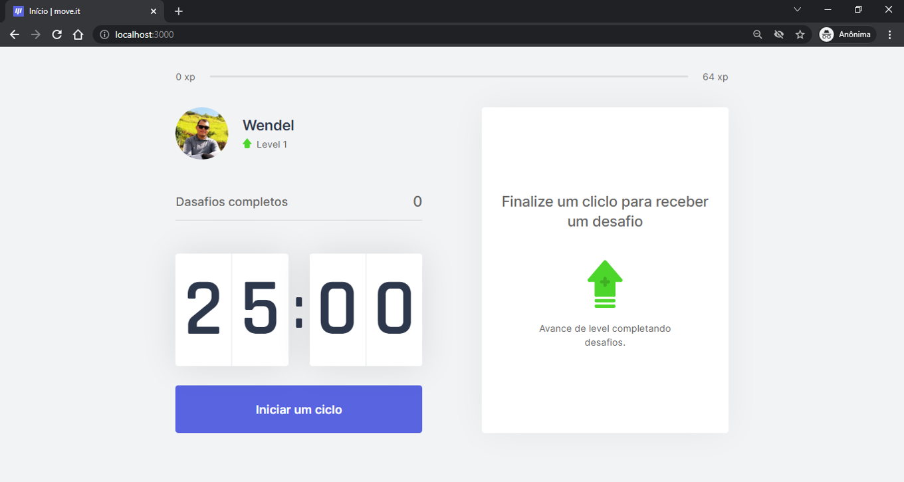

<p align="center">
  
</p>

<h1 align="center">
Melhorias na Aplicação Desenvolvido no </br>
NLW#4 da RocketSeat
</h1>

<p align="center">

  

  

  <a href="https://www.linkedin.com/in/alquiponeto/">
      
  </a>

  <a href="https://github.com/Alquipo/moveit/commits/master">
      
  </a>

  


</p>

<p align="center">

  <a target="_blank" href="https://reactjs.org/">
    
  </a>

  <a target="_blank" href="https://nextjs.org/">
      
  </a>
</p>

<h1 align="center">
  Seja bem-vindo ao Moveit
</h1>

<!--

## :information_source: O que é Next Level Week?

O [NLW](https://nextlevelweek.com/inscricao/1) é uma semana prática com muito código, desafios, network e com um único objetivo: levá-lo ao próximo nível.
Através do método da [Rocketseat](https://nextlevelweek.com/inscricao/1), você aprenderá novas ferramentas, tecnologias e descobrirá hacks que irão impulsionar sua carreira.
Um evento online e totalmente gratuito que o ajudará a dar o próximo passo na sua evolução como desenvolvedor.
-->

## Sobre o Projeto

Moveit é uma ferramenta desenvolvida para auxiliar no uso da técnica Pomodoro.
Essa técnica foi desenvolvida no final dos anos 80 pelo italiano Francesco Cirillo, que procurava uma maneira de aumentar sua produtividade. A técnica consiste em intervalos de trabalho focado de vinte e cinco minutos intercalados por pausas de cinco minutos de descanso. Após quatro clícos deve ser feita uma pausa maior entre quinze e trinta minutos. Por meio dessa técnica, segundo os estudos, pode-se conseguir um aumento na considerável na produtividade duranre a excussão das tarefas.
Essa ferramenta pode ser usada diariamente de forma simples através de sua página web. Em suas próximas verssões será relacionar as atividades com os cíclos e acompanhar a evolução de sua produtividade.


## Layout

Design feito por [Tiago Luchtenberg](https://www.instagram.com/tiagoluchtenberg/)

<!-- ### Mobile
<h4 align="center">
  
  
  
  <!--  -->
<!-- </h4> -->

### Web

<h4 align="center">
  
</h4>
<!--
#### Theme Dark

<!-- <h4 align="center">
  
  
  
  
  
</h4> -->

<!-- #### Theme Light

<h4 align="center">
  
  
  
  
  
</h4>

<br/> -->

<!-- ### Storybook e Test

<h4 align="center">
  

  

</h4>

<br/> -->


## Melhorias a serem feitas
    -Adicionar api serverless na aplicação;
    -Adicionar autenticação com github via Auth0;
    -Adicionar Firebase para efetuar autenticação;
    -Adicionar mongodb para salvar informações;
    -Adicionado theme dark na aplicação;
    -Adicionado Switch para alterar os themes;
    -Adicionado save theme no localStorage;
    -Melhorar a SSR da aplicação
    -Ajustar autenticação no Mobile
    -Adicionado Toast como notificação;
    -Ajustar designer do app para Mobile
    -Adicionar compartilhar com Redes Sociais
    -Concluir os testes

## Tecnologias:

- **[TypeScript](https://www.typescriptlang.org/)**
- **[NextJS](https://nextjs.org/)**
- **[Eslint](https://eslint.org/)**
- **[Prettier](https://prettier.io/)**
<!-- - **[Firebase](https://firebase.google.com/?hl=pt-br)** -->
<!-- - **[Mongodb](https://www.mongodb.com/)** -->
<!-- - **[Axios](https://github.com/axios/axios)** -->
<!-- - **[Styled Components](https://styled-components.com/)** -->
<!-- - **[Jest](https://jestjs.io/)** -->
<!-- - **[React Testing Library](https://testing-library.com/docs/react-testing-library/intro)** -->
<!-- - **[Storybook](https://storybook.js.org/)** -->
<!-- - **[Husky](https://github.com/typicode/husky)** -->
<!-- - **[PlopJS](https://plopjs.com/)** -->
<!-- - **[Polished](https://polished.js.org/)** -->
<!-- - **[Styled-Icons](https://styled-icons.js.org/)** -->

## Comandos

- `dev`: Executa a aplicação em `localhost:3000`
- `build`: Cria a Build do projeto
- `start`: Inicia um servidor simples com o código de produção
<!-- - `lint`: Executa o **Linter** em todos os componentes e páginas
- `test`: Executa **Jest** para testar todos os componentes e páginas
- `test:watch`: Executa **Jest** em watch mode
- `storybook`: Executa **Storybook** em `localhost:6006`
- `build-storybook`: Cria uma build do storybook
- `generate`: Cria automaticamente um componente -->

## Como executar este projeto

Para clonar e executar este aplicativo, você precisará ter o [Git](https://git-scm.com) e [NodeJs](https://nodejs.org/en/) instalado em seu computador.

### Clonando o repositório

```bash
# Clone este repositório
$ git clone https://github.com/wendelspereira/moveit

# Acesse a pasta do projeto no terminal/cmd
$ cd moveit
```

### Rodando a Aplicação

```bash
# Instale as dependências
$ npm install
$ yarn install

# Execute a Aplicação em Desenvolvimento
$ npm run dev
$ yarn dev

# Acesse http://localhost:3000

```

<!-- ### 💾 Comandos Úteis

```bash
#Criação de um componente completo com (index.tsx / stories.tsx / styles.ts / test.tsx)
$ yarn generate ComponentName

#Rodar o Storybook
$ yarn storybook

#Rodar os testes
$ yarn test

``` -->

<!-- ### 📁 Configuração .ENV -->
<!--
```bash
#adicionado .env.example no projeto, lembrar de adicionar as variáveis de ambiente conforme o exemplo

# FIREBASE
NEXT_PUBLIC_APIKEY=
NEXT_PUBLIC_AUTHDOMAIN=
NEXT_PUBLIC_PROJECTID=
NEXT_PUBLIC_STORAGEBUCKET=
NEXT_PUBLIC_MESSAGINGSENDERID=
NEXT_PUBLIC_APPID=
NEXT_PUBLIC_MEASUREMENTID=

# MONGODB
MONGODB_URI=

# API URLS
BASE_URL=

``` -->

## Como contribuir para o projeto

- Faça um **fork** do projeto;
- Crie uma nova branch com as suas alterações: `git checkout -b my-feature`
- Salve as alterações e crie uma mensagem de commit as descrevendo: `git commit -m "feature: My new feature"`
- Envie as suas alterações: `git push origin my-feature`

> Caso tenha alguma dúvida confira este [guia de como contribuir no GitHub](https://github.com/firstcontributions/first-contributions)

## 📝 Licença

Este projeto esta sob a licença MIT. Veja a [LICENÇA](https://opensource.org/licenses/MIT) para saber mais.

Desenvolvido por Wendel S. Pereira [Entre em contato!](https://www.linkedin.com/in/wendelspereira/)
